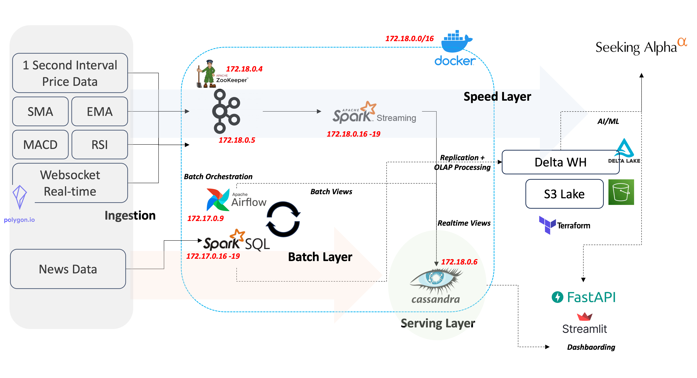
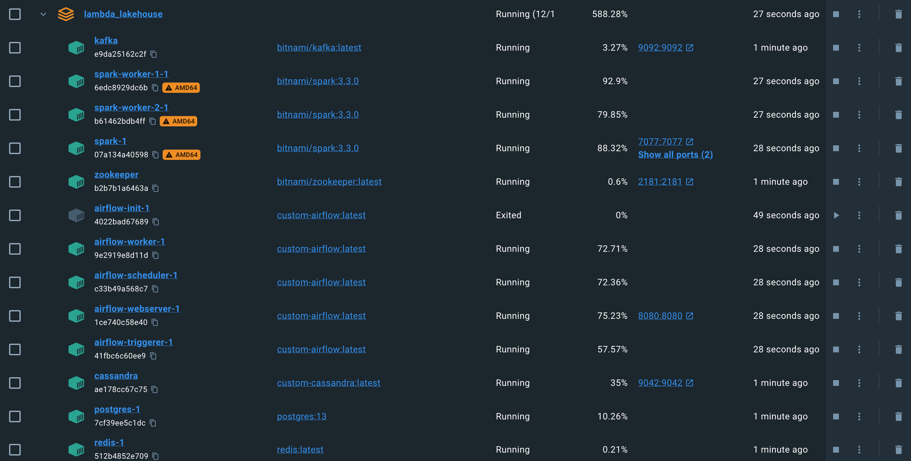
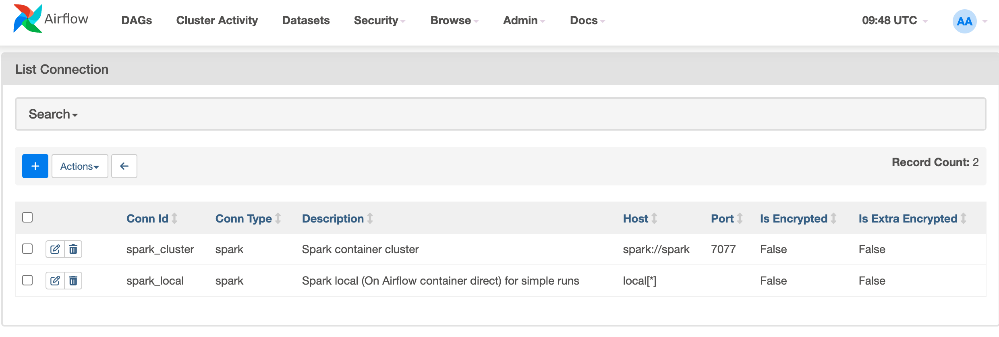
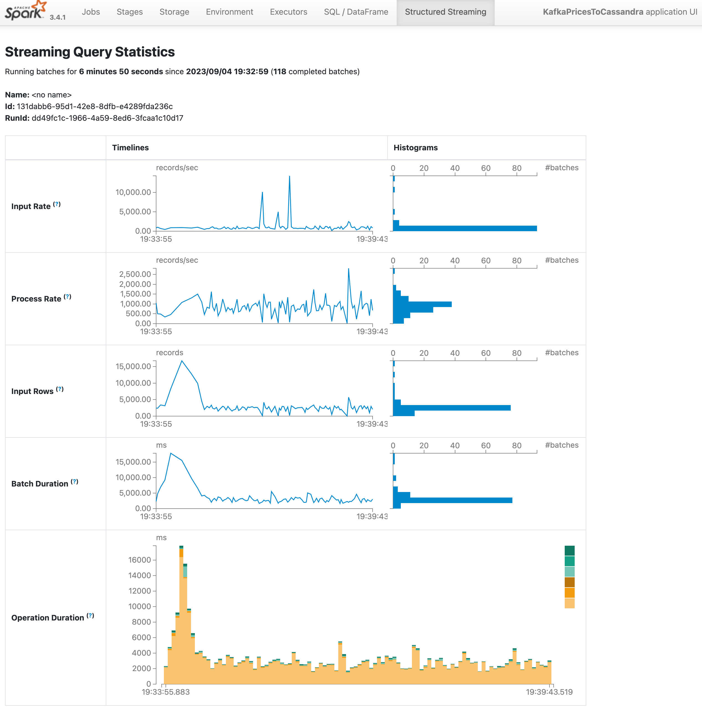
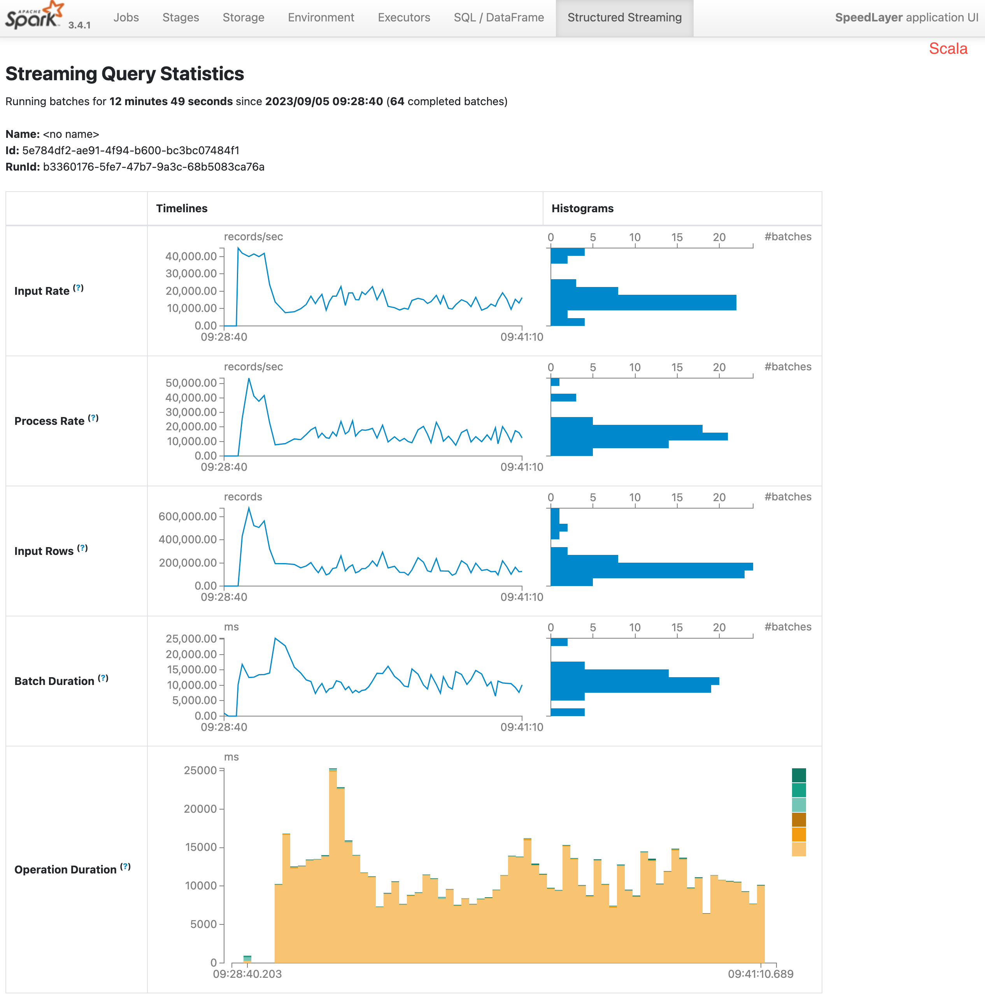
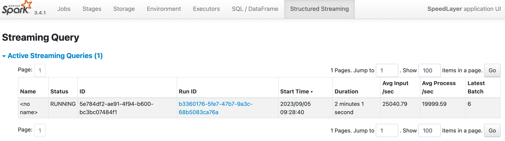
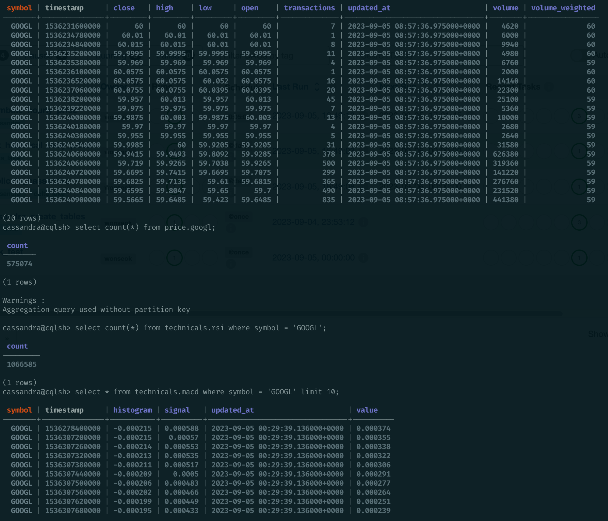
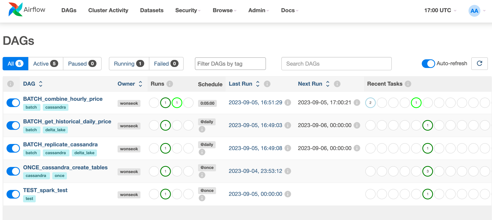
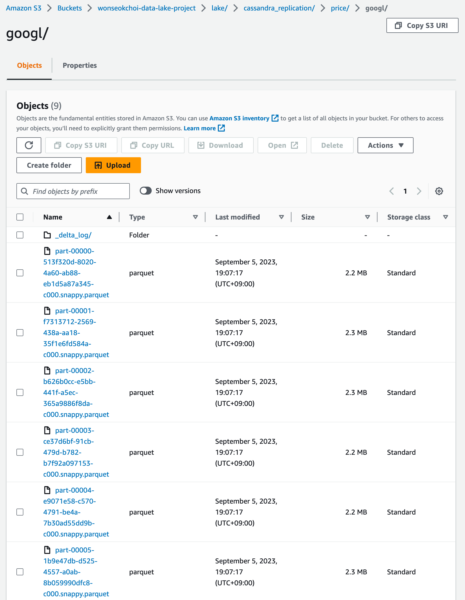

# Fishing for α on the Lakehouse
**Work in Progress**
## Overview
Personal project aiming to go the full A ~ Z in terms of data lifecycle incorporating data ingestion, processing, analytics & dashboarding, ML/DL as well as general software development for presentation. 

Uses stock price data at high frequencies (minutes and secods) to simulate high-latency data streams, as well as large sets of unstructured data ingestion. 

General architecture is a hybrid lambda + lakehouse, with separate speed and batch layers. Also incorporates usage of AWS S3 and delta lake abstraction to simulate both the data lake and warehouse (hence data lakehouse).

Utilizing the data streams, aims to generage "α". 

## Current Status
**Sep. 4, 2023**
- General speed and batch layers built and tested
- Core infrastructure dockerized
- S3 lake terraformed 

## Next Steps
- Large scale ingestion and scraping of news data for sentiment analysis
- MDM and security features
- LSTM/BilSTM modeling and testing
- API set up with simple app (FastAPI, VueJS)

## Technologies
- **Languages:** Python, Scala
- **Tools:** Kafka, Spark, Terraform, Docker, Cassandra, Jupyter
- **Services:** AWS S3,

## Data Used
Utilized [Polygon.io](https://polygon.io) financial API. Plans to also utilize websockets in the future.
More batch oriented data was sourced from libraries like yfinance or other openly available sources. 

## Architecture


## Progress
- Set up infrastructure with docker networking and DNS hostnames within network
    - Unfortunately could not handle an ephemeral Docker operator on Kubernetes on local machine or free-tier cloud VMs so went with static docker containers
    - Airflow latest version also ran on Python 3.8, which made images for Spark incompatible with ARM/64, but was worked



- Airflow, Spark, Cassandra components can all communicate with each other
- Set up Airflow SparkSubmitOperator with networked spark cluster
- Also set up Spark via volume mount to the Airflow container for simple jobs



- Batch ingested second-level technical datas and minute-level price data to Cassandra
    - Optimized using scala for heavier stream loads with some tuning
- Pyspark:

- Scala:


- Was able to achieve almost parity for ~200K rows per second for processing and ingesting


- Cassandra write-speed throttling to handle a heavy load for a single container with limited resources


- Ran Periodic batches to sync and replicate to S3 lake


- Lake data versioning using Delta abstraction as a sort of warehouse
    - Partitioned by timestamps for higher analytic read perfomance
    - Will work on batching for repartitioning or coalescing & file optimization later down the line to handle small-files



## Caveats
Will try and provide static files for streamed data later on. 
To get minute-level data and connect to Polygon.io websocket, you require a paid API key.

## To Reproduce 
### Env. Variables
For now, will use `.env` configurations for secrets management
```
TICKERS = ["AAPL", "AMZN", "GOOGL", "MSFT", "NVDA", "TSLA"]

CASSANDRA_USERNAME = "cassandra"
CASSANDRA_PASSWORD = "cassandra"
AIRFLOW_USERNAME = "airflow"
AIRFLOW_PASSWORD = "airflow"
POLYGON_API_KEY = "<Free key available @Polygon.io but capped to 5 API calls/minute>"
AWS_ACCESS_KEY = "<Required for S3 Terraform>"
AWS_ACCESS_KEY_SECRET = "<Can be generated using AWS IAM>"
```
### Step 1: Deploy Terraform
Change the global unique s3 storage name in terraform files then:
```
~ $ cd s3_data_lake 
~ $ terraform init
~ $ terraform plan 
~ $ terraform apply
# To destroy s3 lake: terraform destroy
# Destroy resources as the configs leave the bucket open for simplicity
```
### Step 2: Build Custom Docker images and launch infras
Most base images are synched to ARM64 
```
~ $ docker build -t custom-airflow -f Dockerfile.airflow .
~ $ docker build -t custom-cassandra -f Dockerfile.cassandra .
~ $ docker-compose up -d
```
Default ports used, but check `docker-compose.yaml`

**E.O.D**
